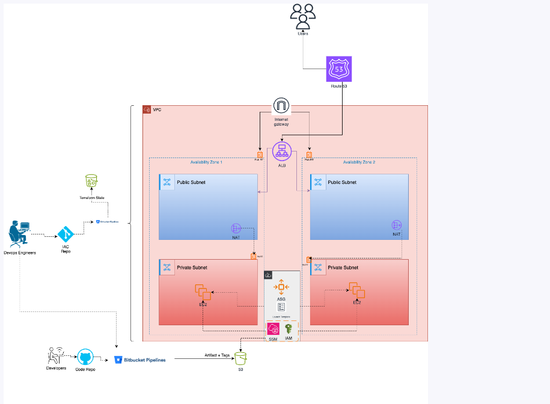
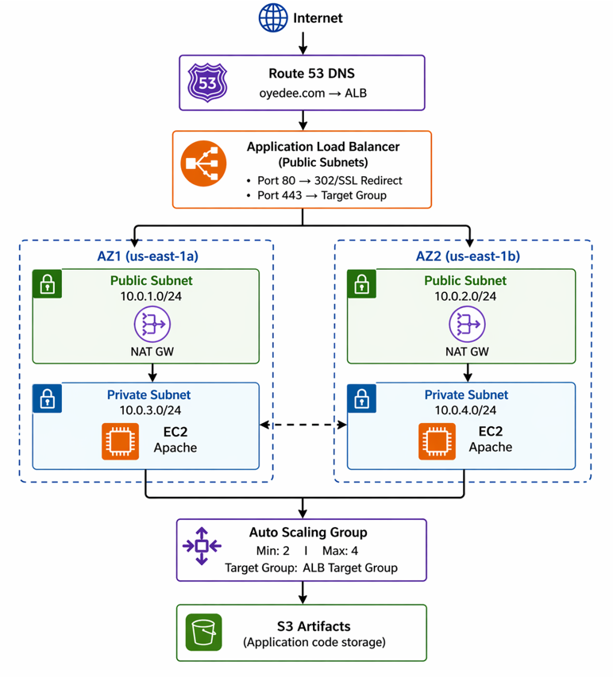

# Production-Grade AWS Three-Tier Web Application Infrastructure

## Project Purpose

This project provisions a **production-ready**, highly available, and secure three-tier web application infrastructure on AWS using **Terraform**. The architecture includes:

- **Presentation Tier**: Application Load Balancer (ALB) with SSL termination and HTTP→HTTPS redirection

- **Application Tier**: Auto Scaling Group of EC2 instances in private subnets running Apache web servers

- **Data Tier**: S3 bucket integration for artifact storage

- **Network Layer**: Custom VPC with public/private subnets across two Availability Zones, NAT Gateways for outbound internet access from private instances

- **Management & Security**: IAM roles with least privilege, SSM for secure instance management, CloudWatch alarms for auto-scaling

- **DNS Management**: Route 53 with root and www domain routing

- **CI/CD Integration**: Bitbucket Pipelines with security scanning (Trivy, Gitleaks) before deployment

This infrastructure follows AWS Well-Architected Framework principles: security, reliability, performance efficiency, cost optimization, and operational excellence.

## Technologies Used

| Category | Technology | Purpose |
|----------|------------|---------|
| **IaC** | Terraform (≥1.6.0) | Infrastructure provisioning with remote state backend |
| **Cloud Provider** | AWS | Compute, network, load balancing, auto-scaling, DNS |
| **Compute** | EC2 (t2.micro) | Apache web server instances |
| **Auto-scaling** | Auto Scaling Group | Dynamic instance scaling based on CPU metrics |
| **Load Balancing** | Application Load Balancer | Traffic distribution, SSL termination, host-based routing |
| **Networking** | VPC, Subnets, Route Tables, IGW, NAT Gateway | Isolated network with controlled internet access |
| **Security** | Security Groups, IAM Roles, SSM | Least-privilege access, secure instance management |
| **Monitoring** | CloudWatch | CPU-based scaling alarms |
| **DNS** | Route 53 | Custom domain management with ALIAS records |
| **SSL/TLS** | AWS Certificate Manager | Certificate management for HTTPS |
| **Storage** | S3 | Artifact storage for application code |
| **CI/CD** | Bitbucket Pipelines | Automated security scanning and deployment |
| **Security Scanning** | Trivy, Gitleaks | Vulnerability and secret detection |
| **Instance Management** | AWS Systems Manager (SSM) | Secure access without SSH bastion |

## Architecture Diagram



## High-Level Traffic Flow



1. **User request** → Route 53 resolves domain to ALB DNS name
2. **HTTP request (port 80)** → ALB listener redirects to HTTPS (302 redirect)
3. **HTTPS request (port 443)** → ALB terminates SSL using ACM certificate
4. **Host header check** → `www.dns.com` redirected to root domain (301 redirect)
5. **Forward to target group** → ALB forwards to healthy instances
6. **Target group** → Distributes traffic across Auto Scaling Group instances in private subnets
7. **NAT Gateway** → Allows private instances to download updates and access S3 (outbound only)
8. **SSM Agent** → Enables secure management without SSH

## Prerequisites

- AWS account with programmatic access keys
- Terraform ≥1.6.0 installed locally
- Domain name registered (e.g., `dns.com`)
- SSL/TLS certificate in AWS Certificate Manager (ACM) in `us-east-1`
- S3 bucket for Terraform state: `webapp-terraform-tfstate-bucket`
- S3 bucket for artifacts: `webapp-s3-bucket-artifacts`
- Bitbucket repository with self-hosted runner (for CI/CD)
- AWS CLI configured

## Deployment Instructions

### Step 1: Configure Prerequisites

#### Generate SSH key pair (if using SSH access)
```
ssh-keygen -t rsa -b 4096 -f <NAME>
```

### Step 2: Create terraform.tfvars

```
aws_account_id
acm_certificate_arn
dns
www_dns
environment
etc
```

### Step 3: Local Deployment

#### Initialize Terraform (downloads providers, configures backend)
```
terraform init
```

#### Validate configuration
```
terraform validate
```

#### Review execution plan
```
terraform plan
```

#### Apply infrastructure
```
terraform apply -auto-approve
```

### Step 4: CI/CD Pipeline Deployment

The Bitbucket pipeline automatically runs on:

- Push to main branch: Security scans only (Trivy + Gitleaks)

- Custom pipeline terraform-apply: Full deployment

- Custom pipeline terraform-destroy: Cleanup

### Step 5: Configure DNS

After deployment, update your domain's nameservers with your registrar:

```
terraform output route53_name_servers
```

### Step 6: Verify Deployment

```
# Get ALB DNS name
terraform output alb_dns_name

# Test application

curl -I http://-raw alb_dns_name
# Expected: HTTP/1.1 302 Found (redirect to HTTPS)


curl -I https://-raw alb_dns_name
# Expected: HTTP/1.1 200 OK


# Test domain
curl https://dns.com
```

---

## Security Design

### Network Security

| Component	| Configuration |	Purpose |
|-----------|---------------|---------|
| **VPC**	| Isolated 10.0.0.0/16 network | Logical isolation |
| **Public Subnets** | 10.0.1.0/24, 10.0.2.0/24	| ALB and NAT Gateway placement |
| **Private Subnets**	| 10.0.3.0/24, 10.0.4.0/24 | Application instances (no public IP) |
| **NAT Gateway** |	One per AZ | Outbound internet only |
| **Security Groups** |	Least privilege | rules	Micro-segmentation |

### Instance Security

#### Instances have:

- No public IP addresses
- SSM for management (no SSH bastion required)
- IAM role with only S3 read permissions
- Security group allowing only HTTP from ALB

### Security Group Rules

|Security Group |	Inbound	| Outbound |
|---------------|---------|----------|
| **ALB SG** |	HTTP (80) from 0.0.0.0/0, HTTPS (443) from 0.0.0.0/0	| HTTP (80) to Instance SG |
| **Instance SG** |	HTTP (80) from ALB SG |	HTTPS (443) to 0.0.0.0/0 (for updates) |

### CI/CD Security Scanning

The Bitbucket pipeline runs two mandatory scans before any deployment:

**1. Trivy Scan**: Filesystem scan for vulnerabilities and secrets

 - Scanners: vuln,secret

  - Severity threshold: HIGH,CRITICAL

  - Exit code 1 on finding


**2. Gitleaks Scan**: Secret detection

  - Scans for hardcoded secrets, API keys, tokens

  - Redacts findings automatically

  - Exit code 1 on finding

## Auto Scaling Configuration
| Parameter	| Value	| Description |
|-----------|-------|-------------|
| **Min Size**	| 2	| Always 2 instances running |
| **Max Size**	| 4	| Scale up to 4 under load |
| **Desired Capacity**	| 2	| Default instance count |
| **Health Check**	| ELB	| ALB monitors instance health |
|**Grace Period**	| 300 sec |	Wait time after launch |
| **Instance Refresh**	| Rolling	| Zero-downtime updates |

### Scaling Policies

| Metric	| Threshold	| Action	| Cooldown |
|---------|-----------|---------|---------|
| CPU > 60% (2 periods)	| Scale Out (+1) |	Add instance |	300 sec |
| CPU < 25% (3 periods)	| Scale In (-1)	| Remove instance	| 300 sec |

## Load Balancer Configuration

| Listener	| Port	| Protocol	| Action |
|-----------|-------|-----------|--------|
| HTTP	| 80	| HTTP	| Redirect to HTTPS (302)
| HTTPS	| 443	| HTTPS	| Forward to Target Group

### Host-based Routing Rule:

  - Condition: www.dns.com

  - Action: Redirect to oyedee.com (301 permanent)

## IAM Roles and Permissions

### Instance IAM Role (webapp-instance-readonly)

**Assumed by**: EC2 service

**Managed Policies**:

  - **AmazonSSMManagedInstanceCore**: SSM for secure management

**Custom S3 Policy**:

```
{
  "Effect": "Allow",
  "Action": ["s3:GetObject"],
  "Resource": ["arn:aws:s3:::webapp-s3-bucket-artifacts/*"]
}
```

## Reasons For No SSH

With SSM configured, you can access instances securely without:

- Opening port 22 to the internet

- Managing SSH keys

- Bastion hosts

- Public IP addresses on instances

- SSM Session Command:

```
aws ssm start-session --target i-xxxxxxxxxx
```

## Remote State Management

Terraform state is stored in S3 backend:

```
bucket  = "webapp-terraform-tfstate-bucket"
key     = "main/terraform.tfstate"
encrypt = true
```

**Benefits**:

  - Team collaboration

  - State file versioning

  - Encryption at rest

  - No local state file conflicts

## Cost Estimation (us-east-1)

| Resource	| Configuration	| Monthly Cost |
|-----------|---------------|--------------|
| NAT Gateway (2)	| $0.045/hour each	| ~$65.70 |
| ALB	| $0.0225/hour + LCU	| ~$16.50+ |
| EC2 (2-4 t2.micro)	| $0.0116/hour each	| ~$16.50 - $33.00 |
| S3 Storage	| State + artifacts	| ~$0.50 |
| Route 53 Hosted Zone	| $0.50/month	| $0.50 |
| Data Transfer	| Variable	| Variable |
| Estimated Total	| Without data transfer	| ~$100 - $120/month

**Note: For Cost optimization**: Reduce NAT Gateways to 1 (single AZ) for non-production.

## Troubleshooting

### A. Issue: Terraform init fails - "Backend configuration changed"

**Solution**: Re-initialize with reconfigure flag:
```
terraform init -reconfigure
```

### B. Issue: Instances failing health checks

**Check**:

#### Verify Apache is running (via SSM)
```
aws ssm send-command --instance-ids i-xxx --document-name "AWS-RunShellScript" --parameters commands="systemctl status httpd"
```

#### Check security group rules
```
aws ec2 describe-security-groups --group-ids sg-xxx
```

#### Verify target group health
```
aws elbv2 describe-target-health --target-group-arn arn:xxx
```

### C. Issue: Cannot pull artifacts from S3

**Solution**: Verify IAM role permissions:

#### Check instance profile
```
aws ec2 describe-iam-instance-profile-associations --instance-id i-xxx
```

#### Test S3 access via SSM
```
aws ssm start-session --target i-xxx
```

#### Inside session:
```
aws s3 ls s3://webapp-s3-bucket-artifacts/
```

### D. Issue: SSL certificate not valid

**Solution**: Ensure ACM certificate is in us-east-1 (required for ALB) and status is "Issued":
```
aws acm describe-certificate --certificate-arn arn:xxx --region us-east-1
```

### E. Issue: www to root redirect not working

**Solution**: Verify listener rule priority and host header:
```
aws elbv2 describe-rules --listener-arn arn:xxx
```

---

## CI/CD Pipeline Details

**Pipeline Triggers**
| Trigger	| Steps Executed |
|---------|----------------|
| Push to **main**	| Trivy scan → Gitleaks scan
| Push to **infrastructure_apply**	| Trivy scan → Gitleaks scan
| Custom **terraform-apply**	| Init → Validate → Plan → Apply
| Custom **terraform-destroy**	| Init → Destroy

### Environment Variables Required

| Variable	| Source	| Purpose |
|-----------|---------|---------|
| AWS_ACCESS_KEY_ID	| Repository variables	| AWS authentication
| AWS_SECRET_ACCESS_KEY	| Repository variables (secured)	| AWS authentication
| AWS_ACCOUNT_ID	| Repository variables	| Account identification

### Self-Hosted Runner Requirements

The pipeline uses a self-hosted runner with:

  - *devrunner* label

  - Linux shell environment

  - Installed tools: *terraform*, *trivy*, *gitleaks*

---

## Future Improvement

- Add WAF (Web Application Firewall) to ALB

- Implement CloudFront CDN for static content

- Implement ElastiCache for session management

- Implement CloudWatch Dashboard for monitoring

---

## Clean Up Resources

**Local destroy**
```
terraform destroy -auto-approve
```

**Via Bitbucket pipeline**
```
Run custom pipeline: terraform-destroy
```

**Manual S3 cleanup**
- aws s3 rm s3://webapp-terraform-tfstate-bucket --recursive
- aws s3 rm s3://webapp-s3-bucket-artifacts --recursive
- aws s3 rb s3://webapp-terraform-tfstate-bucket
- aws s3 rb s3://webapp-s3-bucket-artifacts

---

## License

This project is licensed under the MIT License - see the LICENSE file for details.

## Contributing

- Fork the repository

- Create a feature branch

- Run security scans locally: *trivy fs --scanners vuln,secret --severity HIGH,CRITICAL .*

- Run *terraform fmt -recursive* and *terraform validate*

- Submit a pull request to main

---

## Support

**For issues**:

- Check troubleshooting section

- Review CloudWatch logs

- Check SSM agent status on instances

- Open GitHub issue with terraform plan output and error messages

---

## References
```
https://registry.terraform.io/providers/hashicorp/aws/latest/docs
https://aws.amazon.com/architecture/well-architected
https://trivy.dev
https://gitleaks.io
https://support.atlassian.com/bitbucket-cloud/docs/bitbucket-pipelines-configuration-reference
```
---

## Assessment and Validation

The infrastructure was tested, deployed and accessed via a custom domain.


## Project Supervision

This project was completed under the supervision of:

**Name:** Timothy Eleazu  
**Email:** timeleazudevops@gmail.com  

The supervisor provided guidance, reviewed progress, and assessed the final deployment and presentation.


## Student name

**Name** Adeola Oriade

**Email:** adeoladevops@gmail.com 

### This repository is part of my ongoing effort to document my cloud journey and share what I learn publicly.